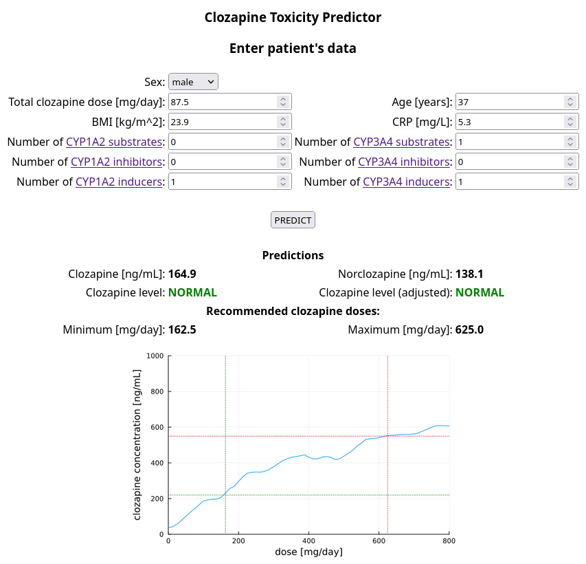

# Clozapine Toxicity Predictor

[](https://doi.org/10.5281/zenodo.11048224)

This [Julia](https://julialang.org/) toolbox allows predicting [clozapine](https://en.wikipedia.org/wiki/Clozapine) and [norclozapine](https://en.wikipedia.org/wiki/Desmethylclozapine) blood concentrations using RandomForestClassifier and RandomForestRegressor models.

Individual recommended safe dose range can also be predicted:


## Performance

The models are actively developed and its accuracy is improving.

### Classifier

    RandomForestClassifier accuracy report:                   
            log_loss: 0.0873
            AUC: 1.0                                                 
            misclassification rate: 0.0                                              
            accuracy: 1.0
    confusion matrix:
            sensitivity (TP): 1.0
            specificity (TP): 1.0
                         group
                      norm   high   
                    ┌──────┬──────┐
               norm │   89 │    0 │
    prediction      ├──────┼──────┤
               high │    0 │   29 │
                    └──────┴──────┘

### Regressor

Current regressor model training accuracy:

    Predicting: CLOZAPINE
    RandomForestRegressor accuracy report:
            R²: 0.9582
            RMSE: 72.07
    
    Predicting: NORCLOZAPINE
    RandomForestRegressor accuracy report:
            R²: 0.9625
            RMSE: 33.7286


Current regressor model testing accuracy:


## Quickstart

Clone this repository, go to its folder and run:

```sh
julia src/server.jl
```

Next, go to the local website at [http://localhost:8080](http://localhost:8080), enter patient's data and click the "PREDICT" button.



(!) Adjusted clozapine level is the classifier prediction modified by predicted concentration.

Toxic clozapine level has been defined as 550 ng/mL, recommended therapeutic concentration has been defined as > 220 ng/mL [source: [10.1192/bjp.2023.27](https://doi.org/10.1192/bjp.2023.27)].

## How to Cite

If you use this tool, please acknowledge us by citing our [paper](https://zenodo.org/records/11048224).

## Contributors

Below is the list of contributors and their affiliations.

[Adam Wysokiński](mailto:adam.wysokinski@umed.lodz.pl) [](https://orcid.org/0000-0002-6159-6579)

[Joanna Dreczka](mailto:jdreczka@csk.umed.pl)

[](https://en.umed.pl)

# License

This software is licensed under [The 2-Clause BSD License](LICENSE).

## Disclaimer

**DISCLAIMER: THIS WEBSITE DOES NOT PROVIDE MEDICAL ADVICE**

The information, including but not limited to, text, graphics, images and other material contained on this website are for informational purposes only. No material on this site is intended to be a substitute for professional medical advice, diagnosis or treatment. Always seek the advice of your physician or other qualified health care provider with any questions you may have regarding a medical condition or treatment and before undertaking a new health care regimen, and never disregard professional medical advice or delay in seeking it because of something you have read on this website.